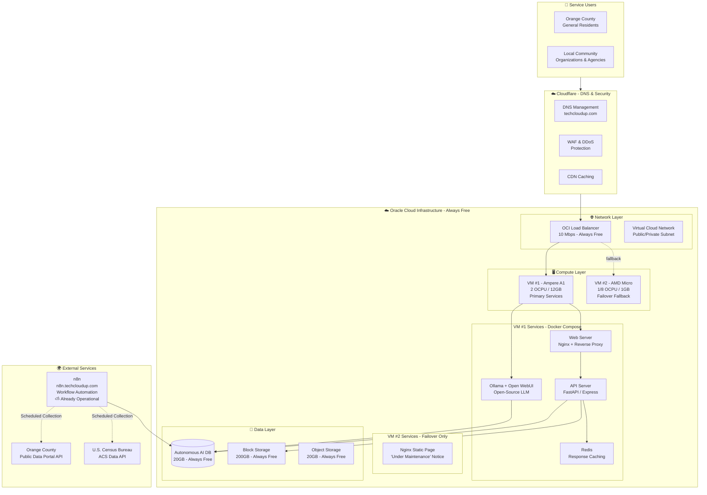

# Orange County Public Service Platform on OCI Always Free — Proposal

## Project Overview

### 1.1 Background & Purpose

This project aims to build a **social enterprise platform** that delivers **intelligent public-data-driven services** to residents of Orange County, California, by maximizing the use of **Oracle Cloud Infrastructure (OCI) Always Free resources** and **open-source AI/automation tools**.

Orange County provides a wide range of public data — including American Community Survey (ACS) data, road infrastructure, demographic & housing characteristics, and economic indicators — via APIs from the U.S. Census Bureau and other agencies. This platform collects, analyzes, and repackages that public data into **information services that residents can easily use in their daily lives**.

### 1.2 Vision & Mission

- **Vision**: An inclusive digital environment where every Orange County resident — regardless of background — can easily access and benefit from public information, with no one left behind.
- **Mission**: Build a sustainable public service platform using only OCI Always Free and open-source technology, delivering **value to the community at zero operational cost**.

### 1.3 Core Service Direction

| Service Area | Description | Data Used |
| :--- | :--- | :--- |
| **Local Info Chatbot** | Natural-language Q&A system powered by open-source LLM (Ollama) | ACS data: demographics, housing, economic indicators |
| **Community Infrastructure Info** | Real-time info on road conditions, public facilities, welfare agency locations | OC road data, WIC agency locations |
| **Personalized Public Alerts** | Scheduled data collection & anomaly detection alerts via n8n workflows | Various public API data |
| **Data Visualization Dashboard** | Web dashboard visualizing regional statistics & trends | Population, housing, economic characteristics |

#### Real-World User Scenarios

Grounded in questions Orange County residents might actually ask:

**🗣 Local Info Chatbot**
| Resident Question (User Scenario) | Information Provided | Confidence |
| :--- | :--- | :--- |
| "Which has a higher median household income, Anaheim or Santa Ana?" | ACS 2025 comparison + source link | 🟢 Confirmed |
| "What's the median home value in my zip code 92701?" | Census-tract-level housing characteristics | 🟢 Confirmed |
| "Which OC city grew the most in population over the last 5 years?" | Year-over-year ACS trend comparison chart | 🟢 Confirmed |
| "How has the work-from-home rate changed since COVID?" | ACS commute-mode shift analysis | 🟡 Estimated |

**📍 Community Infrastructure Info**
| Resident Question | Information Provided |
| :--- | :--- |
| "Where is the nearest WIC office to my home?" | Distance-sorted list + hours + phone |
| "Is there any road construction scheduled in my neighborhood this week?" | OC Public Works schedule mapping |
| "Where can I find free meal programs for my kids?" | Summer Meals / School Lunch site locations |

**🔔 Personalized Public Alerts**
| User Scenario | Alert Content |
| :--- | :--- |
| "Text me when new road construction starts in my zip code" | New permit detected → SMS/email |
| "I don't want to miss OC policy changes like minimum wage increases" | Policy change detected → weekly digest alert |
| "Alert me if COVID cases spike in our county" | Anomaly detected → immediate alert |

#### Information Confidence System

The core of a public service is **delivering accurate information**. Every chatbot response adheres to the following confidence framework:

| Confidence | Meaning | Criteria |
| :--- | :--- | :--- |
| 🟢 **Confirmed** | Based on official data, source verified | RAG retrieval score ≥ 0.8, includes source link |
| 🟡 **Estimated** | Data-backed but involves interpretation/calculation | RAG retrieval score 0.5–0.8, explicitly marked "Estimate" |
| 🔴 **Verify Needed** | Insufficient data, LLM-augmented response | RAG retrieval score < 0.5, directs user to official sources (e.g., OCHCA) |
| ⛔ **Cannot Answer** | No reliable information available | "Sorry, we couldn't find reliable information on this topic. We recommend contacting XXX agency directly." |

> ⚠️ **RAG Failure Principle**: If the relevance score of retrieved documents falls below the threshold, **never generate an answer**. Saying "I don't know" is far more responsible for a public service than providing incorrect information.

Every response includes source attribution in the format `[Source: Dataset Name, Reference Year, Last Updated]`.

---

## Technical Architecture

### 2.1 Architecture Diagram



### 2.2 Resource Allocation Plan (Reflecting June 2026 Policy)

Effective June 15, 2026, OCI Always Free Ampere A1 Compute limits were reduced from **4 OCPU / 24GB to 2 OCPU / 12GB**. Since n8n is already operational at `n8n.techcloudup.com`, it is excluded from OCI resources, and the entire A1 allocation is dedicated to the primary service VM.

| Resource | Always Free Limit | This Project Allocation | Notes |
| :--- | :--- | :--- | :--- |
| **Ampere A1.Flex** | **2 OCPU, 12GB total** | VM #1: 2 OCPU / 12GB | Dedicated to primary services (Ollama + API + Web) |
| **AMD Micro** | 2 instances | VM #2: 1/8 OCPU / 1GB | Health check + static maintenance page (failover) |
| **Autonomous AI DB** | 2 instances, 20GB each | 1 instance (20GB) | Vector search & RAG |
| **Block Storage** | 200GB total | VM #1 OS 50GB + Data 100GB<br>VM #2 OS 50GB | |
| **Object Storage** | 20GB | Logs, static assets, backups | |
| **Load Balancer** | 1 (10 Mbps) | Traffic distribution & high availability | |
| **Outbound Traffic** | 10 TB/month | Reduced via Cloudflare CDN | |

#### VM #1 Resource Breakdown (A1 2 OCPU / 12GB)

| Component | Estimated Memory | Notes |
| :--- | :--- | :--- |
| OS (Oracle Linux 9) | ~1 GB | |
| Nginx (+ SSL termination) | ~200 MB | Reverse proxy + static file serving |
| FastAPI / Express API Server | ~500 MB | Includes RAG pipeline |
| Ollama + Phi-3-mini (3.8B, Q4) | ~2.5 GB | Fully utilizes 2 OCPU; target 5–8s response |
| Open WebUI | ~300 MB | Chatbot frontend |
| Redis (optional) | ~300 MB | API response caching. Removable if Autonomous DB Result Cache + Nginx FastCGI Cache suffice |
| **Headroom** | **~7 GB** | Peak buffer & future expansion |

> ⚠️ **Caveats**:
> - **Autonomous AI Database** in the Always Free tier is limited to **30 concurrent sessions**. Limit the DB connection pool to 10 and adjust n8n worker count to avoid exceeding the session cap.
> - **For Ollama, lightweight models such as Phi-3-mini (3.8B) or Qwen2 (4B) are recommended** over 7B+ models. On a 2 OCPU environment, 7B models suffer from severe response latency unsuitable for chatbot UX.

#### VM #2 Failover Strategy (AMD Micro)

When VM #1 experiences an outage, the Load Balancer automatically redirects traffic to VM #2. VM #2 only hosts an Nginx static HTML page with the following notice:

> **Service Under Maintenance**
> We are currently performing server maintenance. Service will resume shortly.
> For urgent inquiries: [email/contact]

This approach runs comfortably on an AMD Micro (1/8 OCPU, 1GB RAM) and provides a far better user experience for a public service than a blank error page. Since it only serves a static Nginx page without database queries, it consumes no DB sessions.

---

## Technology Stack

### 3.1 Infrastructure & Operations

| Layer | Technology | Rationale |
| :--- | :--- | :--- |
| **Cloud** | OCI Always Free | Perpetually free resources, ARM-based Ampere A1 support |
| **DNS/Security** | Cloudflare | Integrated DNS, CDN, WAF, DDoS protection — all free |
| **OS** | Oracle Linux 9 / Ubuntu 22.04 LTS | ARM64 architecture optimization |
| **Containers** | Docker + Podman | Lightweight container operations on OCI ARM |
| **Orchestration** | Docker Compose | Simple multi-container configuration management |

### 3.2 Backend & API

| Component | Technology | Rationale |
| :--- | :--- | :--- |
| **Web Server** | Nginx | Lightweight, high-performance reverse proxy & SSL termination |
| **API Server** | Node.js (Express) / Python (FastAPI) | Rich open-source ecosystem, native ARM support |
| **Database** | Oracle Autonomous AI Database | Always Free tier, built-in vector search, APEX support |
| **Caching** | Redis (in-memory) | API response caching for performance |

### 3.3 Open-Source AI Tools

| Tool | Purpose | Notes |
| :--- | :--- | :--- |
| **Ollama** | Run open-source LLMs (Phi-3-mini, Qwen2 4B, etc.) | Docker-based deployment on VM #1 A1 2 OCPU/12GB |
| **Open WebUI** | Web-based chatbot interface for Ollama | Docker + Nginx reverse proxy for HTTPS |
| **LangChain** | RAG (Retrieval-Augmented Generation) pipeline | Open-source LLM application framework |
| **Autonomous DB Vector Search** | Vector embedding search (no separate Vector DB needed) | Oracle 23ai built-in capability |

### 3.4 External Services (Already Operational)

| Service | Purpose | Endpoint |
| :--- | :--- | :--- |
| **n8n** | Workflow automation (public API scheduled collection, data processing, alerts) | `n8n.techcloudup.com` ⛅ |
| **Cloudflare** | DNS, CDN, WAF, DDoS protection | Manages `techcloudup.com` |

### 3.5 Frontend

| Component | Technology | Rationale |
| :--- | :--- | :--- |
| **Framework** | Next.js / React | Rich component ecosystem, SSR/SSG support |
| **Styling** | Tailwind CSS | Rapid responsive design implementation |
| **State Management** | Zustand / React Query | Lightweight, easy server-state synchronization |
| **Data Visualization** | D3.js / Chart.js | Open-source charting libraries |

---

## Quality-Focused Implementation Strategy

### 4.1 Quality of Service (QoS) Assurance

#### 4.1.1 High Availability

| Item | Implementation | Expected Outcome |
| :--- | :--- | :--- |
| **Traffic Distribution** | OCI Load Balancer with VM #1 (primary) + VM #2 (fallback) | Auto-failover to VM #2 static page on VM #1 outage |
| **Auto-Recovery** | OCI instance monitoring + health checks to detect VM #1 recovery | Failover within 5 minutes; auto-rollback on recovery |
| **Data Redundancy** | Autonomous AI DB automatic backup & HA configuration | Zero data loss risk |

#### 4.1.2 Performance

| Item | Implementation | Expected Outcome |
| :--- | :--- | :--- |
| **API Response Caching** | Redis in-memory cache for public API call results | 80% reduction in repeated call latency |
| **CDN Caching** | Cloudflare CDN for static assets & API responses | Improved perceived speed for global users |
| **LLM Optimization** | Quantized lightweight models (Phi-3-mini 3.8B, Qwen2 4B) | 5–8s response even on ARM 2 OCPU |
| **DB Indexing** | Optimized indexes on frequently queried columns | 50% query latency reduction |

#### 4.1.3 Security

| Item | Implementation | Expected Outcome |
| :--- | :--- | :--- |
| **WAF Protection** | Cloudflare WAF to block SQL Injection, XSS, etc. | 99% of web attacks blocked |
| **DDoS Defense** | Cloudflare DDoS protection layer enabled | Large-scale traffic attack defense |
| **End-to-End HTTPS** | TLS across Cloudflare → OCI LB → VMs | Encrypted data in transit |
| **Access Control** | OCI security lists (firewall rules) + IAM policies | Least-privilege principle enforced |
| **Secret Management** | OCI Vault or encrypted environment variables | Sensitive data leak prevention |

#### 4.1.4 Scalability

| Item | Implementation | Expected Outcome |
| :--- | :--- | :--- |
| **Vertical Scaling** | Adjust OCPU/memory within Always Free limits as needed | Temporary traffic spike handling |
| **Horizontal Scaling** | Consider additional VMs + DB sharding if moving to paid tier | Long-term growth readiness |
| **Microservices** | Ollama, API server, WebUI as separate Docker containers | Independent per-module scaling & updates |

### 4.2 Data Quality Management

| Item | Implementation |
| :--- | :--- |
| **Data Validation** | Schema validation step in n8n workflows |
| **Anomaly Detection** | Automatic statistical outlier detection & alerting on collected data |
| **Data Consistency** | Scheduled data integrity checks & deduplication |
| **Metadata Management** | Version & source metadata tagging on all collected datasets |
| **Backup Policy** | Daily automatic backup to Object Storage, 30-day retention |

### 4.3 User Experience (UX) Quality

| Item | Implementation |
| :--- | :--- |
| **Responsive Design** | Optimized for mobile / tablet / desktop |
| **Accessibility** | WCAG 2.1 AA compliance (screen-reader support) |
| **Multi-Language** | English + Spanish (Orange County's primary languages) |
| **Loading Optimization** | Lazy image loading, code splitting, prefetching |
| **User Feedback** | In-service feedback channel + periodic user surveys |

### 4.4 Operational Quality

| Item | Implementation |
| :--- | :--- |
| **Monitoring** | OCI Monitoring service for real-time VM CPU/memory/network tracking |
| **Logging** | Tiered application logs (INFO/WARN/ERROR) stored in Object Storage |
| **Alerting** | Email/SMS alerts on threshold breaches (via n8n workflows) |
| **Zero-Downtime Deploy** | Docker Compose rolling update (launch new container on VM #1 → switch traffic → stop old container) |
| **Disaster Recovery (DR)** | Daily automatic Object Storage backup + n8n-automated recovery procedures (RPO 24h, RTO 4h target) |

### 4.5 Information Reliability — The Core of Public Service Quality

In a public service, **incorrect information directly destroys trust**. A four-layer defense system prevents LLM hallucination and ensures information accuracy.

#### 4.5.1 RAG-Based Source Verification Pipeline

```
User Question
  ↓
Layer 1: RAG Retrieval → Autonomous DB Vector Search for relevant documents
  ↓
Layer 2: Relevance Score Evaluation → If below threshold (0.5), respond "Cannot Answer"
  ↓
Layer 3: Source Mapping → Tag retrieved docs with dataset name, collection date, update cadence
  ↓
Layer 4: LLM Response Generation → Prompt constrained to "Answer using only the provided documents"
  ↓
Response + [Source: ACS 2025 Table B19013, Updated: 2026-06-15] + Confidence Badge
```

#### 4.5.2 Four-Tier Response Confidence System

| Confidence | RAG Score | Example Response | Guideline |
| :--- | :--- | :--- | :--- |
| 🟢 **Confirmed** | ≥ 0.8 | "As of 2025, Santa Ana's median household income is $78,450 [Source: ACS 2025]" | Direct official data citation |
| 🟡 **Estimated** | 0.5–0.8 | "Aggregating multiple data points, we estimate an approximate 15% increase [Source: ACS 2023-2025]" | Trend analysis or calculation involved |
| 🔴 **Verify Needed** | < 0.5 | "Insufficient recent data on this topic. We recommend checking directly with OC Health Care Agency (www.ochealthinfo.com)." | Data gaps, direct to official source |
| ⛔ **Cannot Answer** | N/A | "Sorry, we currently have no reliable information to answer this question." | Zero RAG results; never guess |

> ⚠️ **Core Principle**: Completely prevent the LLM from "making up" answers. Respond only based on retrieved documents. If RAG returns no results, **never answer**.

#### 4.5.3 Data Provenance Management

| Item | Implementation |
| :--- | :--- |
| **Source Metadata** | Mandatory tags on all collected data: `source`, `collection_date`, `update_frequency`, `contact_org` |
| **Data Freshness** | n8n workflow tracks each source's update cadence; alerts operator on refresh delays |
| **Versioning** | Dataset snapshots stored by version in Object Storage; enables historical comparison |
| **Source Transparency** | Public `/data-sources` page listing all data sources with update dates |
| **Corrigenda** | Error correction log on a dedicated page with revision history; maintains institutional trust |

#### 4.5.4 User Feedback → Data Improvement Loop

```
User rates response "Was this helpful? 👍 / 👎"
  ↓ 👎
"What was inaccurate?" (free text)
  ↓
n8n workflow → Operator Slack/Email alert + feedback DB entry
  ↓
Operator review → Source data verification → manual correction if needed
  ↓
Correction logged in corrigenda → reflected in next data refresh cycle
```

> Even officially published public data can contain errors or lags. **Resident feedback serves as the primary detection layer for data quality improvement.**

### 4.6 Operational Governance

Technology alone cannot maintain public service quality. A **minimal human-in-the-loop operating framework** is defined below.

#### 4.6.1 Role Definitions

| Role | Responsibilities | Estimated Time |
| :--- | :--- | :--- |
| **Service Operator** | Server health monitoring, incident response, deployment management | 2–3 hrs/week |
| **Data Curator** | Data source discovery, quality review, metadata management, user feedback response | 2–4 hrs/week |
| **Community Manager** | User inquiry response, social media, local organization partnerships | 1–2 hrs/week |

> Initially, 1–2 people will cover all roles, with a weekly operational commitment of 5–8 hours to maintain service quality.

#### 4.6.2 Recurring Operational Activities

| Cadence | Activity |
| :--- | :--- |
| **Daily** | n8n workflow success check (automated), DB session usage check |
| **Weekly** | New data source research, user feedback review & response, chatbot incorrect-answer log analysis |
| **Monthly** | Service usage report, data freshness audit, Always Free policy change monitoring |
| **Quarterly** | LLM prompt tuning (based on incorrect-answer patterns), RAG retrieval quality evaluation, security vulnerability scan |

#### 4.6.3 Data Collection Governance

| Principle | Description |
| :--- | :--- |
| **Public Data First** | Only use data officially published by government/public agencies; third-party data requires source verification |
| **Collection Transparency** | `/data-sources` page publicly discloses all data sources, collection cadence, and terms of use |
| **Zero PII Collection** | Never collect or store any personally identifiable information (PII) from residents. All data is at the aggregated level only |
| **Data Retention Policy** | Raw snapshots: 30 days, processed data: 1 year, analysis results: indefinite (reflected in Object Storage lifecycle policies) |

---

## Domain & Network Configuration

### 5.1 DNS Delegation Structure

`techcloudup.com` remains managed by Cloudflare, with only the `oc.techcloudup.com` subdomain delegated to OCI DNS.

```
techcloudup.com (Managed by Cloudflare)
    └── oc.techcloudup.com (Delegated to OCI DNS)
            ├── A Record → OCI Load Balancer Public IP
            └── (Additional subdomains as needed)
```

**Implementation Steps**:
1. Create `oc.techcloudup.com` zone in OCI DNS → note OCI nameservers (NS)
2. Add NS record in Cloudflare DNS (`Name: oc`, `Nameserver: <OCI NS addresses>`)
3. Create A record in OCI DNS → point to OCI Load Balancer IP

### 5.2 Network Security Configuration

| Component | Configuration |
| :--- | :--- |
| **VCN** | 10.0.0.0/16 (Public Subnet: 10.0.1.0/24, Private Subnet: 10.0.2.0/24) |
| **Ingress Rules** | HTTPS (443) only, allowed from Cloudflare IP ranges |
| **Egress Rules** | HTTPS (443) allowed for public API calls |
| **Load Balancer** | Deployed in public subnet, HTTPS listener configured |

---

## Project Timeline (8 Weeks)

Since n8n is already operational at `n8n.techcloudup.com`, no separate build phase is needed. Sufficient buffer has been allocated for OCI resource provisioning and LLM tuning.

| Phase | Duration | Key Activities | Deliverables |
| :--- | :--- | :--- | :--- |
| **Week 1** | 1 week | OCI VCN setup, security list configuration, Load Balancer creation | Network foundation complete |
| **Week 2** | 1 week | Provision 2 VMs (A1 + AMD Micro), Oracle Linux install, Docker/Compose setup | Compute environment ready |
| **Week 3** | 1 week | Autonomous AI DB creation, schema design, n8n workflow data pipeline integration | Data collection infrastructure |
| **Weeks 4–5** | 2 weeks | Deploy Ollama + Open WebUI, install & prompt-tune lightweight LLM | AI Chatbot MVP |
| **Weeks 6–7** | 2 weeks | FastAPI/Express API server development, RAG pipeline, web frontend | Application complete |
| **Week 8** | 1 week | Cloudflare DNS delegation, end-to-end testing, monitoring/logging, load testing, documentation | Service launch |

---

## Estimated Costs (Monthly)

| Item | Cost | Notes |
| :--- | :--- | :--- |
| OCI Always Free Resources | **$0** | Free within usage limits |
| Cloudflare (Free Plan) | **$0** | DNS, CDN, WAF included |
| Domain (techcloudup.com) | Already owned | Already secured |
| **Total Monthly Operating Cost** | **$0** | |

---

## Expected Impact & Social Value

### 6.1 Quantitative Metrics

| Metric | Target (Year 1) |
| :--- | :--- |
| Monthly Active Users (MAU) | 500 |
| Public Data API Calls Served | 10,000+ per month |
| Chatbot Q&A Interactions | 1,000+ per month |
| Service Availability | 99.5% (≤ 3.6 hrs downtime/month) |

### 6.2 Qualitative Metrics

| Metric | Measurement Method | Target (Year 1) |
| :--- | :--- | :--- |
| Chatbot Answer Satisfaction | "Was this helpful? 👍/👎" | ≥ 80% 👍 rate |
| User Retention Rate | % of users using service ≥ 2x/month | ≥ 30% |
| Perceived Information Trust | Quarterly survey: "Do you trust the information from this service?" | ≥ 4.0 out of 5 |
| RAG Response Success Rate | % of questions answered with 🟢/🟡 confidence | ≥ 85% |
| ⛔ Cannot-Answer Rate | % of "could not find information" responses | < 10% (higher = data coverage gap) |
| Feedback Response Time | 👎 report → operator review complete | Within 48 hours |
| Data Freshness Compliance | % of data sources refreshed within their update cadence | ≥ 95% |

### 6.3 Social Impact

- **Improved Information Access**: Anyone can access public information without technical barriers
- **Community Engagement**: Public data usage fosters local problem-solving communities
- **Digital Divide Reduction**: Free service delivers digital benefits without economic burden
- **Sustainable Social Enterprise Model**: Proves that $0 operating cost can generate real social value

---

## Risks & Mitigation

| Risk | Impact | Mitigation |
| :--- | :--- | :--- |
| **Always Free Policy Changes** | Further resource limit reductions | • Regular policy monitoring<br>• Paid-tier migration options prepared |
| **Instance Reclamation** | Idle VMs auto-terminated | • Minimum health-check traffic maintained<br>• Cron jobs to sustain CPU utilization |
| **LLM Performance Degradation** | Poor user experience | • Lightweight model selection & quantization optimization<br>• Caching to reduce repeated-query latency |
| **Public API Changes / Outages** | Service functionality loss | • Multiple data sources maintained<br>• API change detection & auto-alert system |
| **Security Breach** | Data leak | • Cloudflare WAF + OCI security list dual defense<br>• Regular security audits & vulnerability scans |

---

This proposal presents the optimal approach for implementing a **sustainable public service platform using only OCI Always Free resources and open-source technology**. By using zero trial services, the platform can operate at **$0 ongoing cost even after any free trial periods expire**, realizing an inclusive and sustainable digital public service aligned with the social enterprise mission.

For detailed implementation guides for each phase or any additional questions, please reach out anytime.

---

## Appendix: Implementation Checklist

### Phase 0 — Pre-Flight

- [ ] **0.1** Verify OCI CLI is configured & authenticated (`oci os ns get`)
- [ ] **0.2** Confirm OCI Always Free limits for current tenancy (`oci limits resource-availability get`)
- [ ] **0.3** Verify Cloudflare DNS access for `techcloudup.com`
- [ ] **0.4** Confirm n8n is healthy at `n8n.techcloudup.com` (existing service)
- [ ] **0.5** Install `docker`, `docker-compose`, `git` on local machine (for provisioning scripts)
- [ ] **0.6** Create project directory structure on local:
  ```
  oc-techcloudup/
  ├── terraform/          # or OCI CLI scripts
  ├── docker/
  │   ├── nginx/
  │   ├── api/
  │   ├── ollama/
  │   └── docker-compose.yml
  ├── n8n-workflows/
  ├── frontend/
  └── scripts/
  ```

### Phase 1 — Network Layer (Week 1)

- [ ] **1.1** Create VCN: CIDR `10.0.0.0/16`, DNS resolver enabled
- [ ] **1.2** Create Public Subnet: `10.0.1.0/24` (us-phoenix-1 AD-1)
- [ ] **1.3** Create Private Subnet: `10.0.2.0/24` (us-phoenix-1 AD-1)
- [ ] **1.4** Create Internet Gateway, attach to VCN
- [ ] **1.5** Create NAT Gateway in Public Subnet, attach to VCN
- [ ] **1.6** Configure Route Tables:
  - Public RT: `0.0.0.0/0 → Internet Gateway`
  - Private RT: `0.0.0.0/0 → NAT Gateway`
- [ ] **1.7** Create Security List — Public (`sl-public`):
  - Ingress: TCP 443 from Cloudflare IP ranges only
  - Ingress: TCP 22 from your management IP only (for SSH)
  - Egress: TCP 443 to `0.0.0.0/0`
  - Egress: TCP 80 to `0.0.0.0/0` (for package updates, API calls)
- [ ] **1.8** Create Security List — Private (`sl-private`):
  - Ingress: TCP 1522 from Public Subnet only (DB access)
  - Ingress: TCP 443 from Public Subnet only
  - Egress: TCP 443 to `0.0.0.0/0`
- [ ] **1.9** Attach security lists to subnets
- [ ] **1.10** Reserve a public IP for Load Balancer
- [ ] **1.11** Create OCI Load Balancer (10 Mbps, Always Free tier):
  - Listener: HTTPS/443 → Backend Set → VM #1:80 + VM #2:80
  - Health Check: `GET /health` on port 80, interval 30s, timeout 10s, unhealthy threshold 3
  - Session persistence: disabled (stateless API)

### Phase 2 — Compute Layer (Week 2)

- [ ] **2.1** Provision VM #1 — Ampere A1.Flex:
  - Shape: `VM.Standard.A1.Flex`, 2 OCPU, 12 GB RAM
  - Boot volume: 50 GB (Oracle Linux 9 aarch64)
  - Subnet: Public (`10.0.1.0/24`), assign public IP
  - SSH key: upload `~/.ssh/oc-techcloudup.pub`
- [ ] **2.2** Provision VM #2 — AMD Micro:
  - Shape: `VM.Standard.E2.1.Micro`, 1/8 OCPU, 1 GB RAM
  - Boot volume: 50 GB (Oracle Linux 9 x86_64)
  - Subnet: Public (`10.0.1.0/24`), assign public IP
  - SSH key: same as VM #1
- [ ] **2.3** SSH into VM #1 and run initial setup:
  ```bash
  sudo dnf update -y
  sudo dnf install -y docker-engine docker-compose-plugin git nginx certbot
  sudo systemctl enable --now docker
  sudo usermod -aG docker opc
  ```
- [ ] **2.4** SSH into VM #2 and run initial setup:
  ```bash
  sudo dnf update -y
  sudo dnf install -y nginx
  sudo systemctl enable --now nginx
  ```
- [ ] **2.5** Attach 100 GB Block Volume to VM #1 (mount to `/data`)
- [ ] **2.6** Create `/data/` directory structure on VM #1:
  ```
  /data/
  ├── ollama/        # model storage
  ├── logs/          # app logs
  ├── nginx/         # SSL certs, configs
  └── backups/       # local temp backups before Object Storage sync
  ```
- [ ] **2.7** Verify both VMs are reachable via SSH and Load Balancer health checks pass
- [ ] **2.8** Set up cron job on VM #1 for minimal CPU activity (prevent Always Free idle reclamation):
  ```bash
  */10 * * * * curl -s http://localhost/health > /dev/null
  ```

### Phase 3 — Storage Layer

- [ ] **3.1** Create Object Storage bucket: `oc-public-data` (Standard tier, us-phoenix-1)
- [ ] **3.2** Configure Object Storage lifecycle policy: auto-archive logs > 30 days
- [ ] **3.3** Create pre-authenticated request (PAR) for backup uploads (rotate every 90 days)
- [ ] **3.4** Test Object Storage upload/download via OCI CLI from VM #1

### Phase 4 — Database Layer (Week 3)

- [ ] **4.1** Provision Autonomous Database (ATP):
  - Workload type: **Autonomous Transaction Processing**
  - Always Free: 1 OCPU, 20 GB storage
  - Admin password: generate & store in OCI Vault or encrypted `.env`
- [ ] **4.2** Configure network access: Private endpoint in Private Subnet (`10.0.2.0/24`)
- [ ] **4.3** Download wallet and copy to VM #1 (`/data/wallet/`)
- [ ] **4.4** Create database schema:
  - `public_data.datasets` — source metadata (name, url, collection_date, update_frequency, contact_org)
  - `public_data.documents` — raw ingested documents with vector embeddings
  - `public_data.query_logs` — anonymized Q&A history (no PII)
  - `public_data.feedback` — user thumbs up/down + free-text corrections
  - `public_data.alerts` — n8n-triggered alert records
- [ ] **4.5** Create vector index on `public_data.documents.embedding` (COSINE similarity, 384 or 768 dims)
- [ ] **4.6** Set connection pool limit to **10** (to respect 30-session ceiling):
  - Application-side: `pool.max = 10`
  - DB-side: `ALTER SYSTEM SET sessions = 30`
- [ ] **4.7** Test DB connection from VM #1 via SQL*Net (port 1522) using wallet
- [ ] **4.8** Create DB user for application with `SELECT, INSERT` only (least privilege)

### Phase 5 — AI & Chatbot (Weeks 4–5)

- [ ] **5.1** Clone project repo to VM #1 and `cd docker/`
- [ ] **5.2** Create `docker-compose.yml` with services: `nginx`, `api`, `ollama`, `open-webui`, `redis` (optional)
- [ ] **5.3** Ollama service configuration:
  ```yaml
  ollama:
    image: ollama/ollama:latest
    volumes:
      - /data/ollama:/root/.ollama
    ports:
      - "127.0.0.1:11434:11434"
    restart: unless-stopped
  ```
- [ ] **5.4** Pull & test lightweight LLM models on VM #1:
  - `ollama pull phi3:mini` (Phi-3-mini 3.8B, ~2.3 GB)
  - `ollama pull qwen2:4b` (Qwen2 4B, ~2.6 GB, optional fallback)
  - Verify: `ollama run phi3:mini "Hello, what OC services are available?"`
  - Measure: should respond within 5–8 seconds on 2 OCPU
- [ ] **5.5** Open WebUI service configuration:
  ```yaml
  open-webui:
    image: ghcr.io/open-webui/open-webui:main
    volumes:
      - open-webui-data:/app/backend/data
    ports:
      - "127.0.0.1:3000:8080"
    environment:
      - OLLAMA_BASE_URL=http://ollama:11434
    restart: unless-stopped
  ```
- [ ] **5.6** Verify Open WebUI loads at `http://<VM1-IP>:3000` and connects to Ollama
- [ ] **5.7** Create RAG prompt template with 4-tier confidence instruction
- [ ] **5.8** Write Python/Node embedding script: chunk → embed (all-MiniLM-L6-v2 or intfloat/e5-small-v2) → store in Autonomous DB

### Phase 6 — API Server (Weeks 6–7)

- [ ] **6.1** Directory: `src/api/` with FastAPI (Python) or Express (Node.js)
- [ ] **6.2** Implement endpoints:
  - `POST /api/chat` — main Q&A with RAG pipeline
  - `GET /api/datasets` — list available public data sources
  - `GET /api/health` — health check for Load Balancer
  - `POST /api/feedback` — user feedback submission
  - `GET /api/alerts` — active public alerts
- [ ] **6.3** RAG pipeline in `/api/chat`:
  1. Embed user query → Vector Search against Autonomous DB
  2. If cosine score < 0.5 → return `{"confidence": "cannot_answer", ...}`
  3. Retrieve top-3 chunks → format context
  4. Send `system: "Answer ONLY using this context. If unsure, say so." + context + question` to Ollama
  5. Return response + `confidence` badge + `source` attribution
- [ ] **6.4** Implement Redis caching (optional):
  - Cache TTL: 1 hour for public data queries, 24 hours for static info
  - Cache key: `md5(query + language)`
- [ ] **6.5** API Dockerfile:
  ```dockerfile
  FROM python:3.12-slim
  WORKDIR /app
  COPY requirements.txt .
  RUN pip install -r requirements.txt
  COPY src/api/ ./api/
  CMD ["uvicorn", "api.main:app", "--host", "0.0.0.0", "--port", "8000"]
  ```
- [ ] **6.6** Test API locally: `curl -X POST http://localhost:8000/api/chat -d '{"query": "median income Santa Ana"}'`

### Phase 7 — Frontend (Weeks 6–7)

- [ ] **7.1** Bootstrap Next.js project: `npx create-next-app@latest frontend --typescript --tailwind`
- [ ] **7.2** Build pages:
  - `/` — Landing page with search bar → chatbot interface
  - `/datasets` — Public data source catalog with freshness badges
  - `/alerts` — Active public alerts dashboard
  - `/dashboard` — Data visualization (Chart.js/D3.js)
  - `/about` — Project mission, governance, data policy
- [ ] **7.3** Implement chatbot UI component:
  - Message bubble with confidence badge (🟢🟡🔴⛔)
  - Source attribution link below each answer
  - Thumbs up/down feedback buttons
  - Loading skeleton during API call
- [ ] **7.4** Implement i18n: English (default) + Spanish (`es`) toggle
- [ ] **7.5** Accessibility: WCAG 2.1 AA — semantic HTML, ARIA labels, keyboard navigation
- [ ] **7.6** Build & export static: `next build && next export -o out/`
- [ ] **7.7** Copy `out/` to VM #1 `/var/www/html/` (served by Nginx)

### Phase 8 — Nginx Reverse Proxy & SSL

- [ ] **8.1** Nginx config on VM #1 (`/etc/nginx/conf.d/oc-platform.conf`):
  ```nginx
  # Frontend static files
  server {
      listen 80;
      server_name oc.techcloudup.com;
      root /var/www/html;
      index index.html;

      # API proxy
      location /api/ {
          proxy_pass http://127.0.0.1:8000;
          proxy_set_header Host $host;
          proxy_read_timeout 30s;
      }

      # Open WebUI proxy
      location /chat/ {
          proxy_pass http://127.0.0.1:3000;
          proxy_set_header Host $host;
          proxy_set_header X-Forwarded-For $proxy_add_x_forwarded_for;
      }
  }
  ```
- [ ] **8.2** Nginx config on VM #2 (`/etc/nginx/conf.d/fallback.conf`):
  ```nginx
  server {
      listen 80;
      server_name oc.techcloudup.com;
      root /var/www/fallback;
      index index.html;
      # Single static maintenance page, no proxying
  }
  ```
- [ ] **8.3** Create fallback HTML page on VM #2 with maintenance message
- [ ] **8.4** Test Nginx config: `nginx -t && systemctl reload nginx`
- [ ] **8.5** SSL: Certbot DNS challenge via Cloudflare API → get wildcard cert for `*.techcloudup.com`
- [ ] **8.6** Apply SSL cert to Nginx on both VMs (update listeners to 443)
- [ ] **8.7** Enable HSTS header: `add_header Strict-Transport-Security "max-age=63072000" always;`

### Phase 9 — n8n Workflow Configuration

- [ ] **9.1** Create n8n workflow: **"OC Data Collector"**
  - Trigger: Schedule (daily at 2 AM PT)
  - HTTP Request → OC Public Data API / Census ACS API
  - Transform node: flatten JSON, add `collection_date`, `source` metadata
  - Oracle DB node: INSERT into `public_data.documents`
  - Error handling: retry 3x, then Slack/email alert
- [ ] **9.2** Create n8n workflow: **"Data Freshness Monitor"**
  - Trigger: Schedule (weekly Monday 9 AM PT)
  - Query DB: sources where `(NOW() - last_collection_date) > update_frequency`
  - Email/Slack alert: stale data sources list
- [ ] **9.3** Create n8n workflow: **"Feedback Processor"**
  - Trigger: Webhook (called by API when user clicks 👎)
  - Format feedback → Slack notification → store in `public_data.feedback`
- [ ] **9.4** Create n8n workflow: **"Anomaly Detector"**
  - Trigger: Schedule (daily 4 AM PT)
  - Query recent data, apply z-score threshold
  - If anomaly detected → create alert in `public_data.alerts` + notify
- [ ] **9.5** Seed initial data: run "OC Data Collector" manually for first import
- [ ] **9.6** Verify all n8n workflows execute successfully and data appears in Autonomous DB

### Phase 10 — DNS & Go-Live (Week 8)

- [ ] **10.1** Create OCI DNS Zone: `oc.techcloudup.com`
- [ ] **10.2** Note OCI nameservers from zone creation output
- [ ] **10.3** Add NS delegation record in Cloudflare:
  - Type: `NS`
  - Name: `oc`
  - Nameservers: (OCI NS addresses from step 10.2)
- [ ] **10.4** Create A record in OCI DNS: `oc.techcloudup.com → <Load Balancer Public IP>`
- [ ] **10.5** Wait for DNS propagation (up to 24 hours; verify with `dig oc.techcloudup.com`)
- [ ] **10.6** Verify SSL: `curl -I https://oc.techcloudup.com` returns HTTP 200
- [ ] **10.7** Run smoke tests:
  - [ ] Landing page loads
  - [ ] Chatbot returns answer with confidence badge
  - [ ] Source attribution links work
  - [ ] Thumbs up/down feedback stores in DB
  - [ ] Spanish toggle renders correctly
  - [ ] Mobile responsive layout verified
- [ ] **10.8** Simulate VM #1 failure:
  - SSH into VM #1, `sudo systemctl stop docker`
  - Verify Load Balancer health check fails
  - Verify traffic routes to VM #2 maintenance page within 5 minutes
  - Restart VM #1 services, verify auto-rollback
- [ ] **10.9** Run load test: `ab -n 1000 -c 10 https://oc.techcloudup.com/api/health`
- [ ] **10.10** Enable OCI Monitoring alarms:
  - CPU > 80% for 5 min → email alert
  - Memory > 90% for 5 min → email alert
  - Load Balancer unhealthy host count > 0 → email alert

### Phase 11 — Post-Launch (Week 8+)

- [ ] **11.1** Submit sitemap to Google Search Console
- [ ] **11.2** Set up Cloudflare Analytics for traffic insights
- [ ] **11.3** Create `/data-sources` page with all sources & update timestamps
- [ ] **11.4** Document operational runbooks: incident response, backup restore, deployment
- [ ] **11.5** Schedule first monthly data freshness audit
- [ ] **11.6** Schedule first quarterly LLM prompt tuning session
