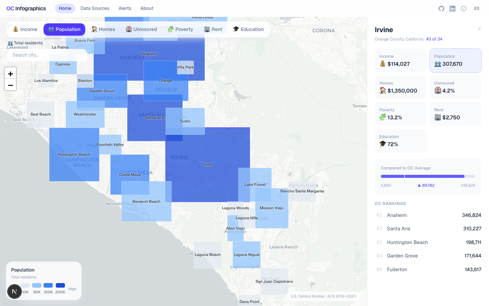

# OC TechCloudUp

> Orange County public data platform — interactive infographic maps, community-supported and open source.

[](https://www.oracle.com/cloud/free/)
[](https://nextjs.org/)
[](LICENSE)
[](https://buymeacoffee.com/scale600)

## Overview

An interactive BI infographic platform that visualizes Orange County, CA demographics through choropleth maps, city-level comparisons, correlation analysis, and time-series trends — community-supported and open source.

**Live**: [oc.techcloudup.com](https://oc.techcloudup.com)



| Before (Chatbot) | After (Infographic Map) |
|---|---|
| LLM response: 15–30 sec | Map load: < 1 sec |
| 1 OCPU saturated | Static + CDN-ready |
| Text-only answers | Visual, color-coded, interactive |

## Architecture (July 2026)

```
                        Internet
                           │
                   Cloudflare (proxy + DNS)
                     SSL Termination
                           │
                  ┌────────▼────────┐
                  │  Compute (A1)    │  ← Production
                  │  1 OCPU / 6 GB   │
                  │  ARM Ampere      │
                  │  Oracle Linux 9  │
                  │                  │
                  │  ┌────────────┐  │
                  │  │  Nginx     │  │
                  │  │  :80/:443  │  │
                  │  │  static    │  │
                  │  │  files     │  │
                  │  └────────────┘  │
                  └──────────────────┘
                           │
                  ┌────────▼────────┐
                  │  Compute (vm3)   │  ← Standby
                  │  E2.1.Micro     │
                  │  1 OCPU / 1 GB  │
                  └──────────────────┘

        SSL: Cloudflare Origin Certificate (15-year, auto-trusted)
```

## Features

- **Choropleth Map** — 34 OC cities with 7 color-coded metric layers
- **Multi-City Comparison** — Shift+Click to select up to 3 cities, side-by-side comparison table
- **County Overview** — OC-wide stats, top/bottom cities, best value insight on initial load
- **Sortable City Table** — Filter, search, sort by any metric across all cities
- **Metric Correlation** — Scatter plot with dual-axis selectors + linear regression trend line
- **Time-Series Trends** — 5-year trend chart per city with OC average reference line
- **City Detail Panel** — Click any city for full stats + OC ranking comparison
- **City Search** — Autocomplete dropdown with instant filtering
- **Comparison Bar** — Visual city-vs-OC-average for any metric
- **Mobile First** — Bottom sheet panel, horizontal scroll metric pills, 100dvh height
- **i18n** — English / Spanish toggle with dynamic `<html lang>`
- **Sharable URLs** — `#metric=population&city=Irvine` deep links

## Tech Stack

### Infrastructure (OCI Always Free)

| Resource | Spec | Role |
|---|---|---|
| **oc-a1** | Ampere A1.Flex (1 OCPU, 6 GB RAM, 30 GB) | Production — Nginx, static files, SSL |
| **oc-platform-vm3** | E2.1.Micro (1 OCPU, 1 GB RAM) | Standby failover |
| **Boot Volume** | ~47 GB | Within Always Free 200 GB |
| **VCN** | Public subnet | — |
| **DNS** | Cloudflare (proxy) | SSL termination, CDN, DDoS protection |

### Application

| Layer | Technology | Why |
|---|---|---|
| **Frontend** | Next.js 16, React 19, TypeScript 5 | Static export, zero JS server needed |
| **Styling** | Tailwind CSS 4 | Utility-first, < 3 KB CSS |
| **Maps** | Leaflet + react-leaflet v5 | Lightweight (42 KB), no API key needed |
| **Charts** | Chart.js + react-chartjs-2 | Comparison bars, scatter plots, trend lines |
| **State** | Zustand | Tiny (1 KB) global state for i18n |
| **Web Server** | Nginx | Static files, gzip, security headers, SSL |
| **SSL** | Cloudflare Origin Certificate | 15-year, auto-trusted by Cloudflare |
| **i18n** | Custom React context | EN / ES toggle, 2 locales, localStorage persistence |
| **Data** | Static JSON (`oc-cities.json`, 26 KB) | No database, client-side processing |

### Key Libraries

```
leaflet, react-leaflet         # Interactive choropleth maps
chart.js, react-chartjs-2      # Comparison bars, scatter, trend charts
zustand                        # i18n state management
tailwindcss                    # Utility CSS framework
```

## Quick Start

### Prerequisites

- Node.js 20+

### Development

```bash
cd frontend
npm install
npm run dev          # http://localhost:3000
```

### Production Build & Deploy

```bash
# Build static frontend
cd frontend && npm run build    # outputs to frontend/out/

# Deploy to production (A1)
scp -r frontend/out/* opc@<a1-ip>:/tmp/oc-platform/
ssh opc@<a1-ip> "sudo cp -r /tmp/oc-platform/* /var/www/oc-platform/ && sudo chown -R nginx:nginx /var/www/oc-platform && sudo systemctl reload nginx"
```

## Data

All data is sourced from the U.S. Census Bureau ACS 2019–2023 5-Year estimates and packaged as a static GeoJSON file (`frontend/public/oc-cities.json`, 26 KB).

Data sources:
- **U.S. Census Bureau ACS 5-Year** — Demographics, income, housing
- **OC Cities GeoJSON** — Static boundary data

## Infrastructure History

The platform has evolved through several phases:

| Phase | Date | Change |
|---|---|---|
| **Chatbot** | Early 2026 | FastAPI + Ollama + Open WebUI + ATP Database + Load Balancer |
| **Static Pivot** | July 2026 | Removed all backend services, static JSON + Nginx on A1 |
| **Production Migration** | July 2026 | Production moved from vm2 (E2.1.Micro) to oc-a1 (A1.Flex, 6 GB) — 6x more RAM headroom |

Previously removed services:
- ✗ Ollama + Open WebUI — Chatbot discontinued
- ✗ FastAPI backend — Frontend uses static JSON
- ✗ ATP Database — Data in static JSON
- ✗ Load Balancer — Cloudflare handles DNS + SSL
- ✗ Redis — No caching layer needed
- ✗ n8n pipeline — Data compiled at build time
- ✗ oc-platform-vm2 — Decommissioned, replaced by oc-a1

## Support

OC Infographics is independently built and maintained as a public resource. If you find it valuable, consider supporting its continued operation:

[](https://buymeacoffee.com/scale600)

Every contribution helps cover infrastructure, domain, and development time — keeping the platform fast, free, and growing.

## License

MIT — see [LICENSE](LICENSE) for details.
